# better_chat Plugin

The plugin for bdsx

---

## **[Admin Command]**

### Minecraft form to make changes into plugin configuration

`/bchat`

> 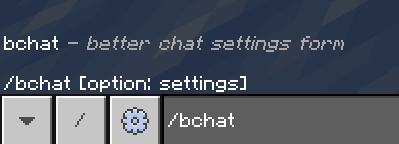
>
> 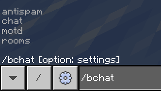

### Settings

- **Antispam**

> *Antispam Settings*
>
> 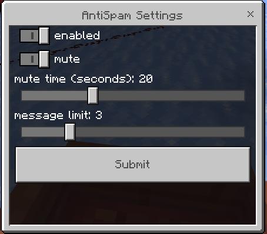

- **Chat**

> *Chat Settings*
>
> 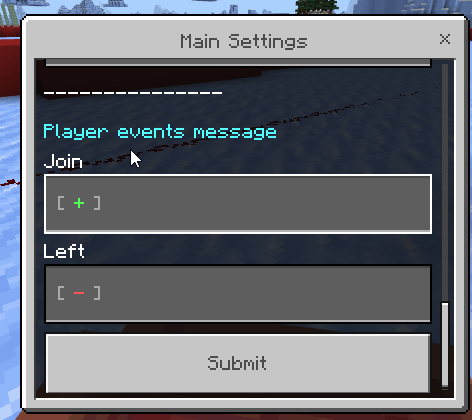
>
> 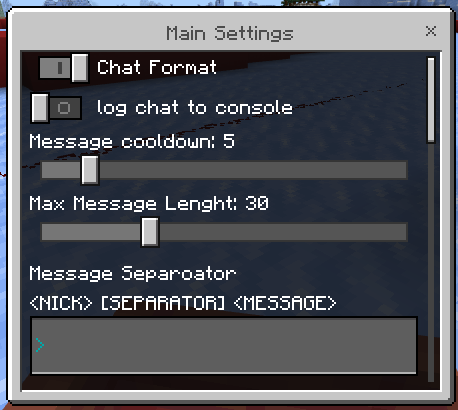

- **Motd**

> *Motd Mainmenu*
>
> 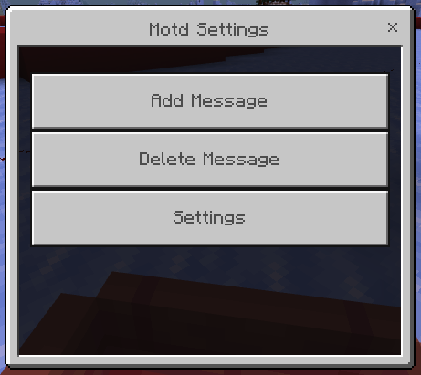
>
> *Motd Settings*
>
> 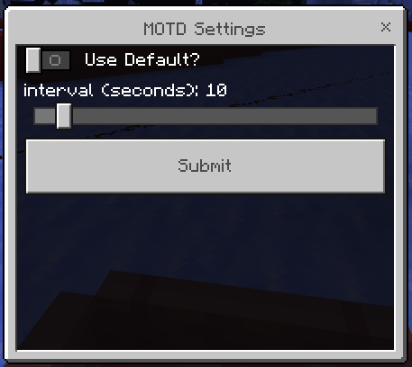
>
> *Motd Add message*
>
> 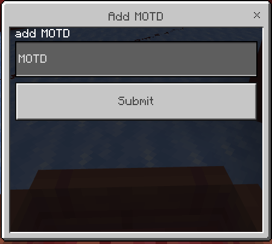
>
> *Motd Delete message*
>
> 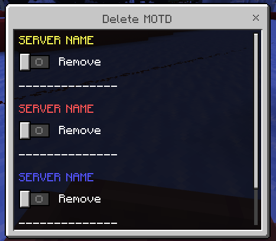

- **Rooms**

> *Rooms Settings*
>
> 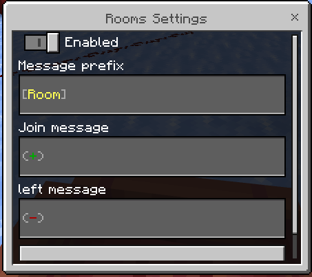

---

## **[Player Command]**

`/room`

### Options

- Join
- Create
- Left
- Disolve

> 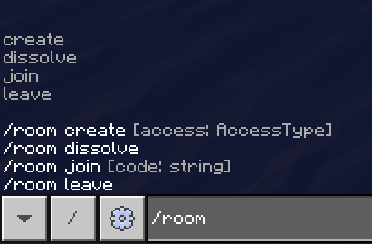
